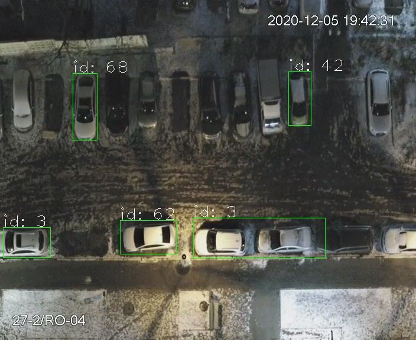

# Parkspace

Проект по поиск свободных парковочных мест по камерам сверху на основе размеченных заранее доступных мест для парковки.

Based on Mask RCNN lib. [Mask RCNN github](https://github.com/matterport/Mask_RCNN)

**Предобученная модель:** 
- скачать в каталог `./models`: [mask_rcnn_coco.h5](https://github.com/matterport/Mask_RCNN/releases/download/v2.0/mask_rcnn_coco.h5)

Пример запуска на предобученной модели, baseline:


## Сбор датасета

Сохранение изображений с камеры в настоящий момент:
```
python src/devline.py --url <server_url> --port <server_port --user <user> --password <password> --dir cams
```

[Devline API](https://devline.ru/aboutweb/#cams)

Если нет возможности подключиться к серверу видеонаблюдения, можно собрать первый датасет для разметки и проверки вручную.

## Первый запуск

Запуск с предобученной моделью:

```
python detect.py
```

по умолчанию подхватит базовую модель `models/mask_rcnn_coco.h5` для распознвания объектов.
- Вход: `dataset/data/` - изображения по маске *.jpg внутри каталога 
- Результат: `out/`


## Обучение

### 1. Разметка
- собрать train, val выборки
- разметить при помощи via.html
- подложить датасет и разметку по следующим путям

### 2. Обучение на размеченных данных
```
python src/train.py --dataset=dataset --weights=coco
```

### 3. Использование новой модели

tbd


[link]: http://www.ya.ru

[test]: http://ya.ru

## Links
- [Snagging Parking Spaces with Mask R-CNN and Python](https://medium.com/@ageitgey/snagging-parking-spaces-with-mask-r-cnn-and-python-955f2231c400)
- [Object detection using Mask R-CNN on a custom dataset](https://towardsdatascience.com/object-detection-using-mask-r-cnn-on-a-custom-dataset-4f79ab692f6d)

