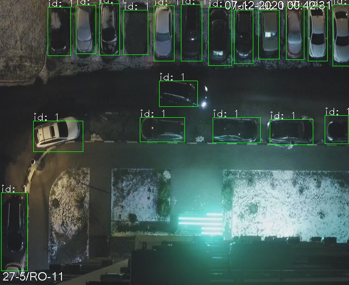
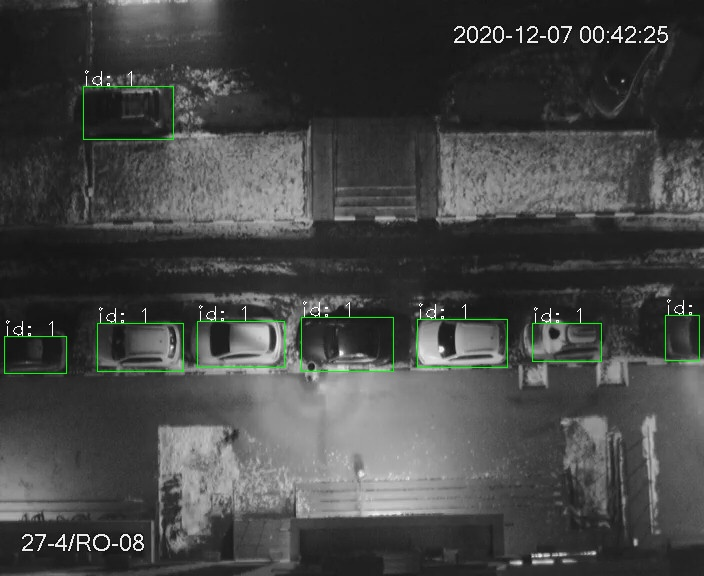

# Parkspace

Проект по поиску свободных парковочных мест по камерам сверху на основе размеченных заранее доступных мест для парковки.

Based on Mask RCNN lib. [Mask RCNN github](https://github.com/matterport/Mask_RCNN)

**Предобученная модель:** 
- скачать в каталог `./models`: [mask_rcnn_coco.h5](https://github.com/matterport/Mask_RCNN/releases/download/v2.0/mask_rcnn_coco.h5)

Пример запуска на предобученной модели, baseline:


## Настройка окружения

Нужен python3.7 (c 3.8 и выше первая версия tf недоступна).

```
virtualenv --python=/usr/bin/python3.7 venv
source venv/bin/activate
pip install -r requirements.txt

```


## Сбор датасета

Сохранение изображений с камеры в настоящий момент:
```
python src/devline.py --url <server_url> --port <server_port --user <user> --password <password> --dir cams
```

[Devline API](https://devline.ru/aboutweb/#cams)

Если нет возможности подключиться к серверу видеонаблюдения, можно собрать первый датасет для разметки и проверки вручную.

## Первый запуск

Запуск с предобученной моделью Mask RCNN, скачанной на этапе подготовки:

```
python src/detect.py --weights models/mask_rcnn_coco.h5  --data <images_dir> -out <out_images_detected_dir>
```

На выходе сложит размеченные изображения, с распознанными машинами в указанную директорию.


## Обучение

### 1. Разметка
- собрать train, val выборки
- разметить при помощи via.html
- подложить датасет и разметку по следующим путям

### 2. Обучение на размеченных данных
```
python src/train.py --dataset=dataset --weights=coco
```

ETA: 10-15 изображений для обучения, 30 эпох, gpu 1050Ti -> 20h

Попробовать [colab.research.google.com](colab.research.google.com) для обучения с gpu.

### 3. Использование новой модели

При обучении модели после каждой эпохи складываются в logs в поддиректории.
Дообученную модель нужно положить в `models/some_new_model_name.h5` и указать при запуске распознавания:
```
python src/detect.py --data <images_dir> --weights <models/some_new_model_name.h5> --out <images_detected_dir>
```

Обученная на 15 изображениях модель выдаёт заметно лучшие результаты, хотя и встречаются ложноположительные/ложноотрицательные результаты:

Пример: видно, что пустое парковочное место прокрасилось в занятое, остальные машины определились корректно.



Пример: машина в темном углу осталась незамеченой, но корректные пустые места остались.


TODO:
- попробовать увеличить качество изображений
- получать изображения без служебной информации (дата, время)
- дообучать модели под разное время суток/погодные условия и пр. (может быть иметь несколько моделей)


[link]: http://www.ya.ru

[test]: http://ya.ru

## Links
- [Snagging Parking Spaces with Mask R-CNN and Python](https://medium.com/@ageitgey/snagging-parking-spaces-with-mask-r-cnn-and-python-955f2231c400)
- [Object detection using Mask R-CNN on a custom dataset](https://towardsdatascience.com/object-detection-using-mask-r-cnn-on-a-custom-dataset-4f79ab692f6d)

